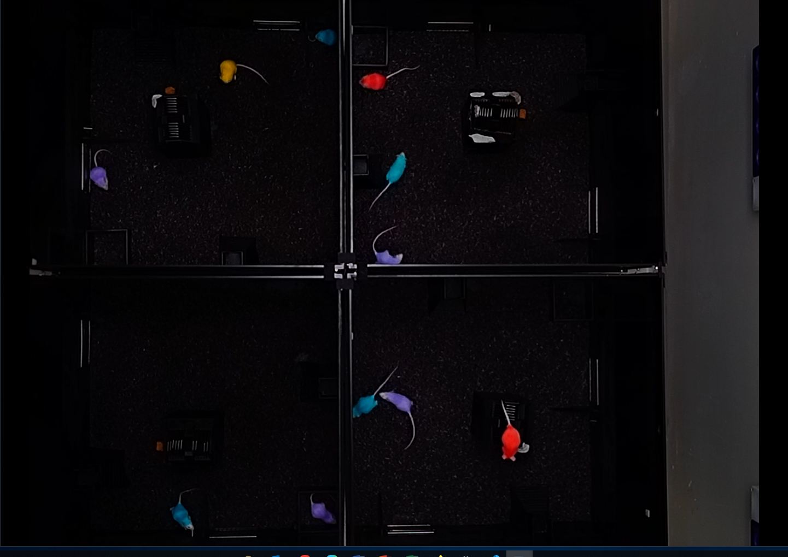

### Project proposal (Tommaso Biagini)

##### Introduction

Our lab is studying the effect of stress on the central nervous system (CNS) using mice as the animal model of choice. In particular in my Ph.D. project I will look into behavioral alterations indued in mice after the application of heavy and repeated stress as the result of territorial conflict. The aim of the study is to generate a new paradigm for the study of post-traumatic stress disorder (**PTSD**) which will shed a new light on the role played by different neuronal population on the insurgence of PTSD and its symptoms.

In order to analyze the behaviors of the animals we have established a setup, the Social Boxes (SB) (Figure 1). In the Social Boxes mice are housed in groups with food and water _ad libitum_: in addition the lights are automatically regulated ensuring 12 hours-long light and dark phase.

Since mice are nocturnal creatures, their activity period coincides with the dark phase of the social boxes. For this reason the SB are also equipped with an extremely low-light sensitive 4K [camera](https://pro.sony/en_EE/products/specialised-cameras/snc-vb770) in order to record mice's behavior for following analysis. 

The first step for the behavioral analysis is to sort the videos in chronological order from the start to the end of the experiment. The videos recorder by the 4K camera are approximately 40-60 seconds each. In addition the files are saved with hexadecimal names making difficult for an operator to quickly identify them. Finally, as the videos comprehend 4 different SB, each video needs to be cropped an merged to save the recording of each SB as a collection of videos of approximately 1 hour each.

##### Aims
From the starting videos perform the following operations:  
1. Sort the files based on hexadecimal order.  
2. Select only the videos with low light conditions (dark phase).
3. Merge videos together to create 1 hour-long videos.
4. Save the videos with comprehensible names.
5. Crop the videos so to generate individual videos per each SB.
